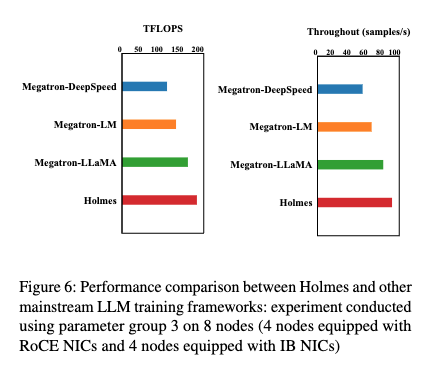

## About


PyTorch Code for our paper:  **Holmes: Towards Distributed Training Across Clusters with Heterogeneous NIC Environment** [[arxiv](https://arxiv.org/abs/2312.03549)]

## Introduction

Holmes, a high-performance training framework for LLMs that employs thoughtfully crafted data and model parallelism strategies over the heterogeneous NIC environment. Our primary technical contribution lies in a novel scheduling method that intelligently allocates distinct computational tasklets in LLM training to specific groups of GPU devices based on the characteristics of their connected NICs. Furthermore, our proposed framework, utilizing pipeline parallel techniques, demonstrates scalability to multi-GPU clusters, even in scenarios without high-speed interconnects between
cluster nodes. Our framework achieves performance levels close to those achievable with homogeneous RDMA-capable networks (InfiniBand or RoCE), significantly exceeding training efficiency within the pure Ethernet environment. Additionally, we verified that our framework outperforms other mainstream LLM frameworks in terms of training efficiency and can be seamlessly integrated with them.

Our codebase is capable of efficiently training large language models with both model and data parallelism over the  heterogeneous NIC environment (including InfiniBand, RoCE and Ethernet).  To demonstrate the framework scaling on multiple nodes and model sizes, we set variable hidden size, number of attention heads, and number of layers to get specific model size and use up to 96 A100 GPUs (equipped with InfiniBand and RoCE NIC) to pretrain GPT models. The following figure shows the TFLOPS and Throughout of GPT-7.5B training on 8 nodes(4 RoCE and 4 IB) within our framework and other mainstream LLM training frameworks.



## Requirements

The codebase was verified on **Python-3.8.10, PyTorch-2.1.0, CUDA Version: 12.1**. We strongly recommend using the latest PyTorch, cuda, nccl and APEX release. You can launch an instance of the PyTorch container and mount Holmes,  your dataset with the following Docker commands:

```
docker pull nvcr.io/nvidia/pytorch:xx.xx-py3
docker run --gpus all -it --rm -v /path/to/Holmes:/workspace/Holmes -v /path/to/dataset:/workspace/dataset nvcr.io/nvidia/pytorch:xx.xx-py3
```

## Usage

We've provided several scripts for pretraining GPT in the **examples** directory.


### GPT Pretraining

- The **examples/pretrain_gpt_4_nodes.sh** script runs 32 GPUs (with heterogeneous NIC) for a pretraining task on GPT with 39.1B parameters. 

Most of the arguments are fairly self-explanatory. By default, the learning rate decays linearly over the training iterations starting at `--lr` to a minimum set by `--min-lr` over `--lr-decay-iters` iterations. The fraction of training iterations used for warmup is set by `--lr-warmup-fraction`.  We use `train-iters` as the training iterations requested. Alternatively, one can provide `--train-samples` which is total number of samples to train on. If this option is present, then instead of providing `--lr-decay-iters`, one will need to provide `--lr-decay-samples`. The `--data-path` now includes the additional `_text_document` suffix added in preprocessing.  `--use-hetnet` can control run the GPT pretraining over the heterogeneous NIC environment, and the ` --use-distributed-optimizer` flag to enable overlapped distributed optimizer.

Further command line arguments are described in the source file [`arguments.py`](https://github.com/NVIDIA/Megatron-LM/blob/main/megatron/arguments.py).

To run `examples/pretrain_gpt_XX.sh`, you need to make desired modifications including setting the environment variables for `CHECKPOINT_PATH`, `VOCAB_FILE`, `DATA_PATH` to specify the data path.  And you also need to specify the network interface (`SOCKET_IFNAME`) and Host Channel Adapter (`HCA`) for network card. Make sure to set these variables to their paths in the container. 

### Arguments

#### `--use-hetnet`

Enable cross-cluster pipeline parallelism and automatic NIC selection in the heterogeneous NIC environment.

#### `--hetero-mode`

Specify the heterogenous training mode pp.

#### `--hetero-device-types`

specify the device type or INC environment of the current node.

#### `--hetero-pipeline-stages`

specify the stage splitting configuration. For example, given 2 4 4 3 5 5 5, the total pipeline parallel size is 2 + 3 = 5, the total number of the model layers is 4 + 4 + 5 + 5 + 5 = 23, the pipeline parallel size for the first device type in the hetero-device-types list is 2 and the pipeline parallel size for the second device type in the hetero-device-types is list 3.

#### `--overlapped-distributed-optimizer`

Enable overlapped distributed optimizer in the LLM training.


Further command line arguments are described in the source file [`arguments.py`](https://github.com/NVIDIA/Megatron-LM/blob/main/megatron/arguments.py).

### NCCL Config

Config path：`./config.json`

The config file is used to set the NCCL Environment Variables.

```
[
    {
        "CLUSTER_NAME": "ib",
        "NCCL_NET": "IB",
        "NCCL_IB_DISABLE": "0",
        "NCCL_IBEXT_DISABLE": "0",
        "NCCL_NET_GDR_LEVEL": "3",
        "NCCL_SOCKET_IFNAME": "bond0",
        "NCCL_IB_HCA": "mlx5_5,mlx5_4,mlx5_8,mlx5_9"
    },
    {
        "CLUSTER_NAME": "roce",
        "NCCL_NET": "IB",
        "NCCL_IB_DISABLE": "0",
        "NCCL_IBEXT_DISABLE": "0",
        "NCCL_SOCKET_IFNAME": "bond0",
        "NCCL_IB_HCA": "mlx5_5,mlx5_4",
        "NCCL_IB_GID_INDEX": "3"
    },
    {
        "CLUSTER_NAME": "heter",
        "NCCL_IBEXT_DISABLE": "1",
        "NCCL_IB_DISABLE": "1",
        "NCCL_SOCKET_IFNAMEE": "bond0",
        "NCCL_NET": "Socket"
    }
]
```

see the NCCL document for more details：https://docs.nvidia.com/deeplearning/nccl/user-guide/docs/env.html


### Reference

The work of Megatron-LM , Megatron-LLaMA and FlagScale have given us great inspiration. 

https://github.com/NVIDIA/Megatron-LM

https://github.com/alibaba/Megatron-LLaMA

https://github.com/FlagOpen/FlagScale


### Cite Our Work

```
@article{yang2023holmes,
  title={Holmes: Towards Distributed Training Across Clusters with Heterogeneous NIC Environment},
  author={Yang, Fei and Peng, Shuang and Sun, Ning and Wang, Fangyu and Tan, Ke and Wu, Fu and Qiu, Jiezhong and Pan, Aimin},
  journal={arXiv preprint arXiv:2312.03549},
  year={2023}
}
```
